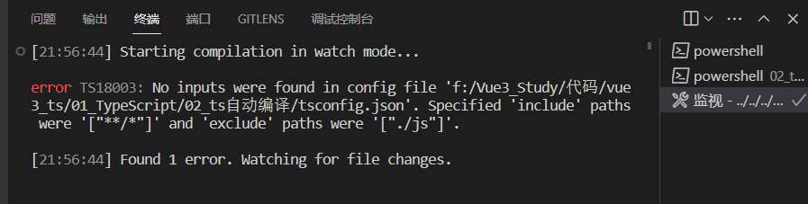
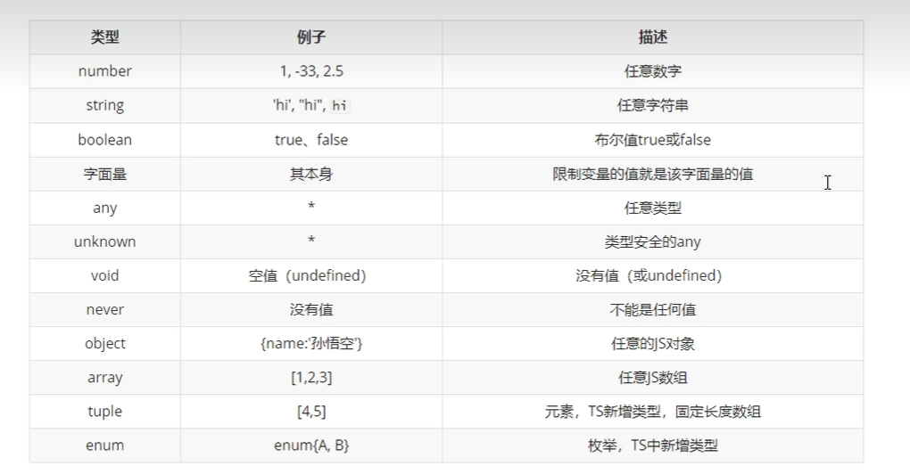
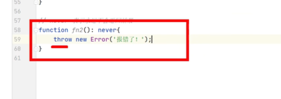

# TypeScript类型

## TS快速上手

### 初识TS

- 区分`js`和`ts`

  - `js`是动态类型语言，运行时才知道变量的类型，且`js`弱类型语言。

  - `ts`是静态类型语言，程序员写代码时就必须指定变量类型，且`ts`强类型语言。
  - 强弱类型语言是指在运行时，变量的类型是否可以隐式转换。

- `TS`简介

  - `TS`是`JS`的超集，主要提供了**类型支持**和`ES6+`。

  - `TS`不能直接在浏览器运行，需要编译成`JS`代码，然后在浏览器上运行。

- `TS`特点

  - 始于`JS`,归于`JS`

  - 强大的类型系统

  - 先进的`JS`

    `TS`提供最新和不断发展的`JS`特性，以帮助建立健壮的组件。

### 安装TS

- 使用`ts`之前需要全局安装

  ```sh
  npm install -g typescript # 全局安装
  ```

- 检查是否安装成功

  ```sh
  tsc -v # 如果显示版本则安装成功
  ```

### 第一个TS程序

- 手动编译代码

  写了以`ts`文件为后缀的内容，在命令行运行下面代码就会得到后缀为`js`的同名文件。

  ```sh
  tsc +文件名  # 将其编译成js文件
  ```

- vscode自动编译代码

  - `vscode`自动编译代码步骤

    ```sh
    1). 生成配置文件tsconfig.json
        tsc --init  
    2). 修改tsconfig.json配置
        "outDir": "./js",
        "strict": false,    
    3). 启动监视任务: 
       vscode菜单栏终端终端 -> 运行任务 -> 显示所有任务 -> 监视tsconfig.json
    ```


  - 监视`tsconfig.json`结果图

    


## 谁可以类型声明

###  变量类型声明

- 【相当于`JS`】变量声明时未指定类型，同时也未赋值，那么后面可以随便给变量赋值`let a`

  底层：其实`ts`会将`a`设置为`any`类型

- 【只声明指定类型，不赋值】变量声明时使用冒号指定变量类型，后续赋值只能赋值对应类型数据`let a:string`

- 【声明时赋值且指定类型，最常见】变量声明时使用冒号指定变量类型，同时赋值`let a:string = 'hello'`

- 【声明时赋值未指定类型】变量声明时未指定而类型，但是同时赋值，`TS`会自动对该变量进行类型检测，指定类型。`let a = 'hello'`

### 函数类型声明

#### 函数参数类型声明

- 其实`js`造成最大困扰的不是变量，往往是<font color=red>函数参数</font>的**类型**和**个数**。

#### 函数返回值类型声明

- 返回值类型写在`函数名()`之后，即`function sum(a: number):number`

---

**总结**

类型声明语法

```ts
let 变量: 类型 = 值
function fn(参数: 类型, 参数: 类型): 返回值类型{
    // 业务逻辑代码
}
```

## 类型

### 基本类型



- `|`符号可以连接具体字符串，还可以连接任意类型(此时就是联合类型)

- `any`不安全是因为：

  - `any`类型的变量可以赋值给其他类型的变量，**`any`不仅影响自己，还伤害别的变量**

- `unknown`安全是因为：

  - `unknown`类型变量自己可以接受任何类型的赋值，但是**`unkown`类型的变量不能直接赋值给其他类型的变量，不能伤害别人**

  - 如果想把`unknown`赋值给其他类型变量，**解决方法**

    - 做`typeof`类型检测然后赋值

      ```ts
      let a:unkwon 
      a = 'hello'
      let s:string
      // 类型检测
      if(typeof a === 'string'){
          s = a
      }
      ```

    - **类型断言**

      上面的写法过于复杂,使用类型断言减少代码量

      ```ts
      let a:unkwon 
      a = 'hello'
      let s:string
      // 类型断言
      // 编译器不知道e是字符串,但是程序员自己知道;所以使用类型断言
      // 下面两种写法等价：1.as写法 2.尖括号写法
      s = e as string; 
      s = <string>e;
      ```

  - 结论：不知道类型时用`unknown`，禁用`any`

- `void`函数返回值为空，`undefined`

- `never`使用场景：使用报错，即函数内部的操作是报错，不能返回值

  

### 复杂类型

#### 对象类型

- `object`

- 

  

  
