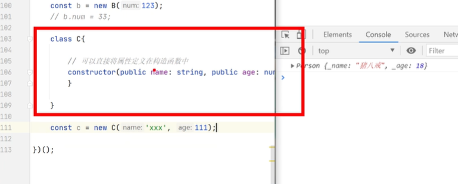
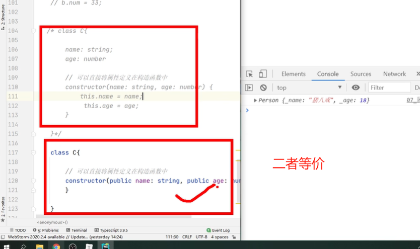

# TypeScript面向对象

## 类class

- 作用

  - 想要创建对象，必须先定义类。
  - 类是模板，对象是实例。

- 在一个类中

  一个类中定义的实例方法，可以直接使用`this.xxx`使用类中定义的实例属性。

## 构造函数



可以直接将属性定义在构造函数中



## 继承

ts会检查不同文件之间的变量名，所以一个文件不能使用另外一个文件全局作用域的名字。

通过继承可以将多个类中共有的代码写在一个父类中，这样只需要写一次即可让所有子类都同时拥有父类的中的属性和方法。

如果希望在子类中添加一些父类的中**没有的属性和方法**，**直接在子类中写即可**。

方法重写

## super

super就是当前类的父类，相当于直接父类类名，可以将之前`父类类名.静态属性/静态方法`换成`suepr`

如果子类重写了构造函数，必须在子类的构造函数中使用`super()`调用父类的构造函数，不然构造不了会报错

## 抽象类

有些类我们只想让他作为基类，被其他类继承，而不想让他去直接声明实例对象

抽象类和其他类区别不大，**只是不能用来创建对象**，如果new一个抽象类会报错

抽象类作用：给别人当父类，给别人继承。

抽象类还有一个作用：里面可以包含抽象方法。函数i

父类中抽象方法不能写花括号，写了花括号就代表重写

子类中必须重写抽象方法，不重写会报错

## 接口

接口和抽象类有点像，但是接口不只和抽象类像，和很多其他东西都像。

抽象类中可以有抽象方法可以有普通方法

但是接口中只能有抽象方法和只声明的属性。

```js
// 接口使用implements关键词实现一个接口
// 必须实现接口1.所有属性 2.所有方法
interface myInter{
    // 接口中属性都不能赋值
    name: string,
    // 接口中方法不能给出定义,即不能写花括号
    sayHello(); 
  }

// 实现接口属性和方法
class myClass implements myInter{
    // 实现属性 
    name: string 
    constructor(name: string){
      this.name = name
    }
    // 实现方法
    sayHello() {
        console.log('大家好');
    }
}
```

## 属性的封装

使用`private`修饰属性

不想让类外部的人

- 使用`实例名.属性`访问属性
- 使用`实例名.属性 = xxx` 修改属性

而是使用`class`中定义的`set`和`get`方法获得属性

这样可以在`set`和`get`方法中写丰富的业务逻辑代码

`get`和`set`被称为属性的存取器。

所以需要为每一个属性都添加一个get和set方法

`private`的属性，在继承的类中也无法使用`this.xxx`获得该属性，因为`private`的属性只能在当前类中使用。

## 泛型

适用情况：

在类型不明确的时候，使用尖括号声明一个变量，用这个变量来代替类型

什么时候知道类型？在函数被调用或类被实例化时。